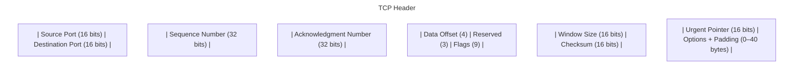
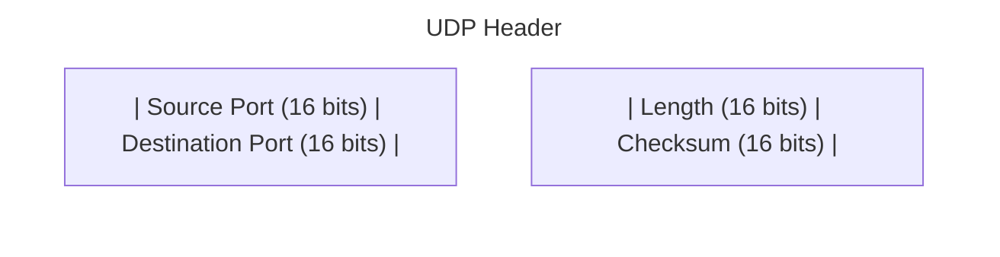
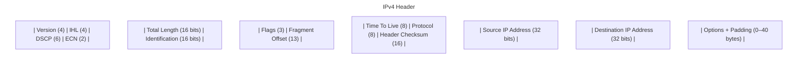

# Network Protocol Headers (TCP, UDP, IP)

This document contains Mermaid diagrams illustrating the structure and field sizes
of **TCP**, **UDP**, and **IPv4** headers.  
All diagrams are compatible with **GitHub Markdown Mermaid rendering**.

---

## TCP Header

**Minimum size:** 20 bytes (160 bits)  
**Maximum size:** 60 bytes (with options)

## UDP Header

## IPv4 Header

